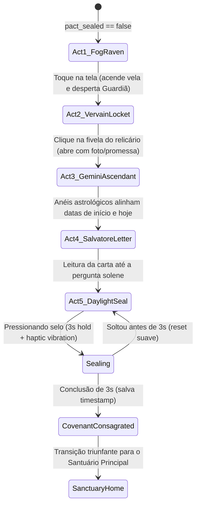

# Technical Spec: 01 - O Ritual do Pedido de Namoro (The Mystic Falls Covenant)

**Consulte `product.md` para a especificação funcional.**

---

## 1. Arquitetura da Máquina de Estados (5 Atos)



---

## 2. Decomposição de Componentes (Frontend Next.js 15 / React 19)

### 2.1 `src/components/ritual/`
1. `FogParticleCanvas.tsx`: Canvas ultraleve gerando partículas de névoa rasteira e fumaça translúcida com baixa carga de GPU.
2. `RavenHarbinger.tsx`: Silhueta do corvo cruzando a tela com queda de pena dourada animada via Framer Motion.
3. `VervainLocket.tsx`: Medalhão de prata e rubi com dobradiça 3D (`transform-style: preserve-3d`), interativo por toque para abertura com revelação de foto e clique metálico.
4. `GeminiAscendant.tsx`: Anéis concêntricos de latão com rotação sincronizada desacelerando até travar nas datas do casal.
5. `SalvatoreParchment.tsx`: Carta com textura de couro/pergaminho antigo, texto com fonte `EB Garamond` e assinatura dourada em `Pinyon Script`.
6. `DaylightWaxSeal.tsx`: Selo de cera carmesim em 3D com pedra de Lápis-Lazúli e anéis concêntricos de cera quente que se expandem com pointer events e `navigator.vibrate([30, 50, 70, 100, 150])`.
7. `RitualOrchestrator.tsx`: Coordena as transições entre os 5 atos, preload de áudio orquestral e mutação de estado.

---

## 3. Schemas & Persistência (Zod + TypeScript)

```typescript
import { z } from 'zod';

export const CovenantPactSchema = z.object({
  isSealed: z.boolean().default(false),
  sealedAt: z.string().datetime().nullable(),
  partnerName: z.string().min(1),
  creatorName: z.string().min(1),
  firstMetDate: z.string().regex(/^\d{4}-\d{2}-\d{2}$/),
  vowText: z.string().min(10),
  relicsUnlocked: z.array(z.enum(['VERVAIN_LOCKET', 'GEMINI_ASCENDANT', 'DAYLIGHT_RING', 'SALVATORE_DIARY'])).default([]),
});

export type CovenantPact = z.infer<typeof CovenantPactSchema>;
```

---

## 4. Checklist de Implementação (Karpathy TDD)
- [ ] **RED:** Testes unitários para `CovenantPactSchema` e para o hook de retenção de toque `useHoldToSeal` (garantindo os 3000ms mínimos).
- [ ] **GREEN:** Implementação do hook `useHoldToSeal` com `requestAnimationFrame` e disparador de `navigator.vibrate`.
- [ ] **GREEN:** Criação do componente `DaylightWaxSeal` com anéis de progresso de preenchimento.
- [ ] **GREEN:** Montagem visual do `VervainLocket` com abertura mecânica.
- [ ] **GREEN:** Integração do fluxo completo no `RitualOrchestrator`.
- [ ] **REFACTOR:** Extração de assets e cópia em PT-BR para `src/content/ritual-text.ts`.

---

## 5. Validação Determinística
- **Testes Unitários:** `npm test -- --silent` com 100% de cobertura nos hooks de selamento e esquemas.
- **Auditoria Mobile:** Verificação em Safari iOS e Chrome Android para responsividade e permissão de toque para áudio.
